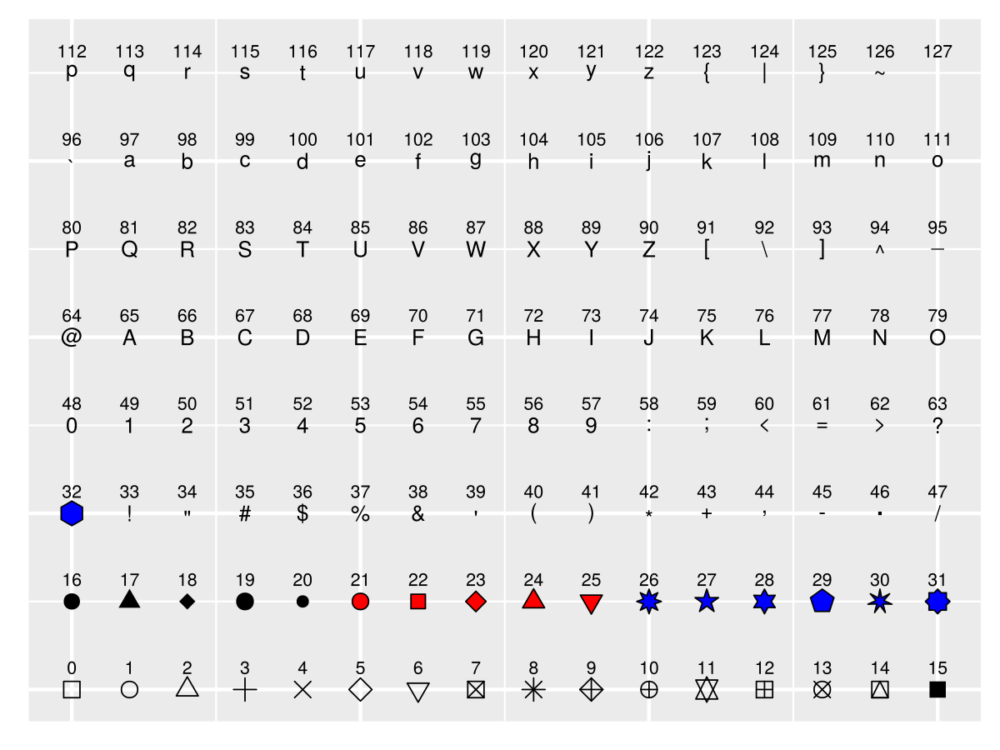
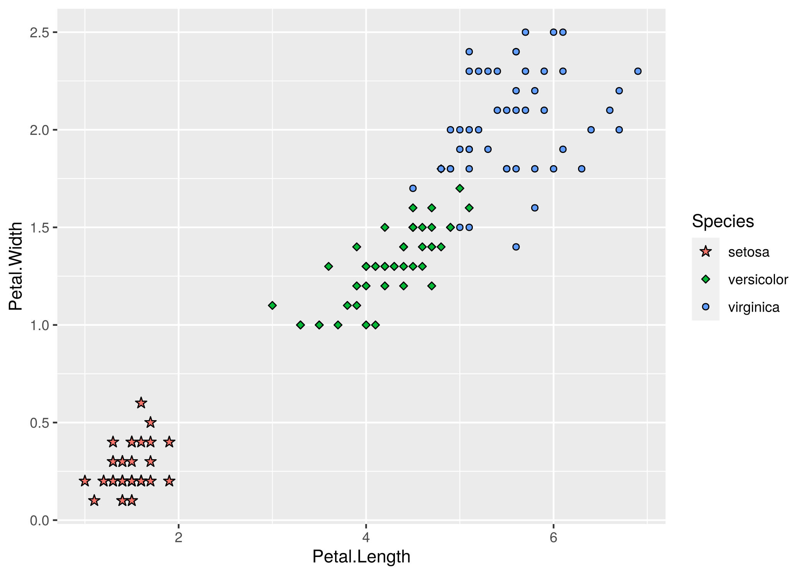

<!-- README.md is generated from README.Rmd. Please edit that file -->

# ggsymbol: symbols layer based on `ggplot2` and `ggstar`

<!--  -->

<!-- [](https://cran.r-project.org/package=ggsymbol) -->

<!-- r badge_devel("xiangpin/ggsymbol", "green") -->

<!-- [](https://cran.r-project.org/package=ggsymbol) -->

<!-- [](https://cranlogs.r-pkg.org/downloads/total/last-month/ggsymbol) -->

<!-- [](https://cranlogs.r-pkg.org/downloads/total/last-week/ggsymbol) -->

The points layer was provided, integrated the shapes of “geom\_point” in
“ggplot2” and some “starshapes” of “geom\_star” in “ggstar”.



The shapes of `0-25` and `33-127` are from `pointsGrob` of `grid`, the
`26-32` are from `starGrob` of
[`ggstar`](https://github.com/xiangpin/ggstar)

# :writing\_hand: Author

[Shuangbin Xu](https://github.com/xiangpin)

School of Basic Medical Sciences, Southern Medical University

# :arrow\_double\_down: Installation

<!-- Get the released version from `CRAN`: -->

<!-- install.packages("ggsymbol") -->

Get the development version from `github`:

``` r
if (!requireNamespace("devtools", quietly=TRUE))
    install.packages("devtools")
devtools::install_github("xiangpin/ggsymbol")
```

# :beginner: Usage

``` r
library(ggplot2)
library(ggsymbol)
p3 <- ggplot(data=iris,
             mapping=aes(x=Petal.Length,
                         y=Petal.Width,
                         fill=Species,
                         symbol=Species)) +
      geom_symbol() + scale_symbol_manual(values=c(27, 23, 21))
p3
```



<!-- # :book: Vignette -->

<!-- For more details, please refer to the [online vignette](https://cran.r-project.org/web/packages/ggsymbol/vignettes/ggsymbol.html) -->

<!-- If you have installed it, you can also view the vignette on local. -->

<!-- browseVignettes("ggsymbol") -->

# :sparkling\_heart: Contributing

We welcome any contributions\! By participating in this project you
agree to bide by the terms outlined in the [Contributor Code of
Conduct](CONDUCT.md).
